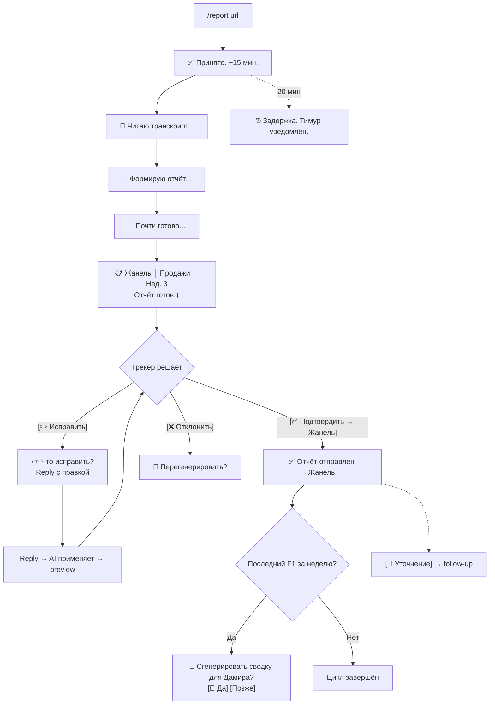
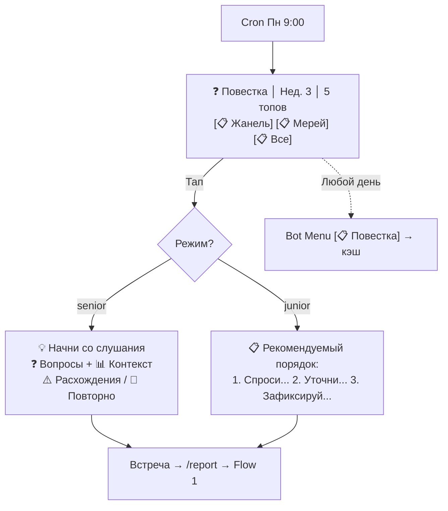
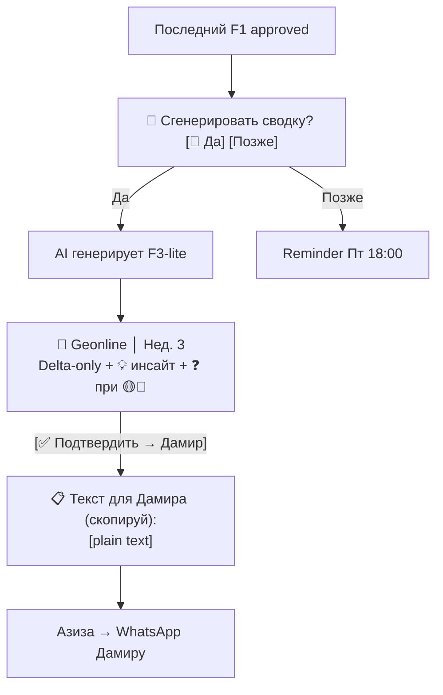
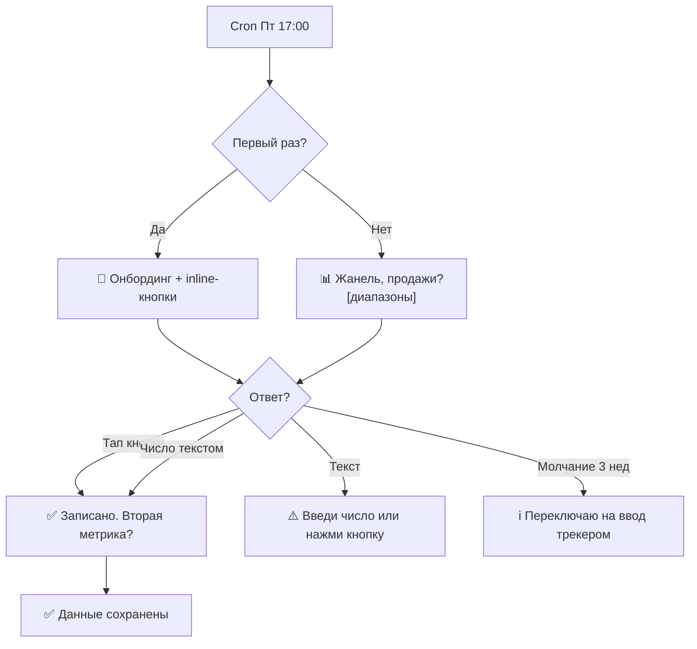
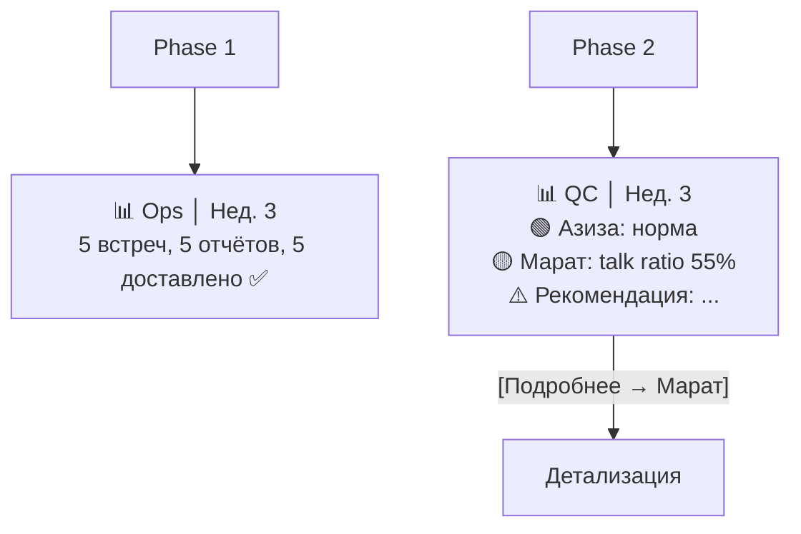

# UX Design Specification workspace

**Author:** Тимур
**Date:** 2026-03-27

---

<!-- UX design content will be appended sequentially through collaborative workflow steps -->

## Executive Summary

### Видение проекта

AI automation pipeline для стратегического коучингового трекинга ARB Solutions. Push-first модель доставки данных через Telegram-бот с Google Sheets как persistence layer. Система создаёт новый feedback loop в существующем процессе трекинга: транскрипт встречи → цепочка AI-промптов → структурированные отчёты (F1), повестки (F4), метрики (F5), уведомления CEO (F3-lite), QC-скоринг (F2). Pipeline невидим для клиента — CEO общается с трекером, не с системой. Каждый output проходит контроль трекера (approve/edit/reject).

### Целевые пользователи

**Трекер (Азиза) — основной пользователь:**
- Еженедельный цикл: повестка (Пн) → встречи (Вт-Чт) → отчёты → сводка CEO (Пт)
- Интерфейс: Telegram-бот (5 команд + inline-кнопки)
- Контекст: ведёт 1-3 клиента, ~8 встреч/нед по 30 мин
- Ключевая потребность: экономия 2-3ч/нед рутины + объективная обратная связь по методологии
- Техническая грамотность: средняя, уверенный пользователь Telegram

**Руководитель ARB (Айдар) — контроллер качества (Phase 2):**
- Интерфейс: QC-сводка в Telegram (еженедельно)
- Контекст: управляет 3-5 трекерами, контролирует качество услуги
- Ключевая потребность: видеть качество всех трекеров на одном экране, получать алерты на отклонения
- Техническая грамотность: средняя

**CEO-клиент (Дамир) — пассивный получатель:**
- Интерфейс: сводное уведомление (5 строк + 🟢🟡🔴) раз в неделю
- Контекст: высокая операционная нагрузка, минимальное внимание
- Ключевая потребность: видеть прогресс постановки практики без усилий
- Техническая грамотность: базовая, Telegram/WhatsApp

**Топ-менеджеры (вторичные пользователи):**
- Интерфейс: F5-запрос метрик через бот (2 числа, 30 сек, Пн утро)
- Контекст: не считают себя пользователями системы
- Ключевая потребность: минимальный friction при вводе данных

### Ключевые UX-вызовы

1. **Telegram как единственный интерфейс (MVP):** Лимит 4096 символов, ограниченное форматирование, но zero friction для всех ролей (уже в Telegram). Требует scannable-дизайна: иконки-маркеры, структурированные заголовки, минимум текста
2. **Калибровка доверия к AI:** Трекер должен доверять отчётам достаточно, чтобы отправлять без переписывания. Метки `[approximate]` и `[speaker_check]` как механизм постепенной калибровки доверия (первые 2-3 недели)
3. **Три роли — три модели взаимодействия:** Трекер = частое рабочее взаимодействие (ежедневно). CEO = пассивное потребление (раз в неделю, 30 сек). Руководитель = аналитический обзор (раз в неделю, 5 мин). Единый бот, разные UX-парадигмы
4. **Вовлечение топ-менеджеров в F5:** Не-пользователи системы должны еженедельно вводить 2 числа. Inline-кнопки с диапазонами (1 тап) как основной паттерн, свободный ввод как fallback

### UX-возможности

1. **Прогресс-индикация через `editMessageText`:** Одно сообщение обновляется при прохождении каждого шага chain (4 шага) — трекер видит прогресс генерации отчёта в реальном времени
2. **Адаптивный формат уведомлений CEO:** Если вовлечённость низкая (не открывает 2+ недели) — автоматическое сокращение до одного предложения + один вопрос
3. **Accountability через UX-дизайн:** Commitments с цитатами из транскрипта создают «цифровой след обещаний» — UX как инструмент формирования поведения, а не только отображения информации
4. **Контекстные подсказки в повестке (F4):** Направляющие вопросы для трекера формируют навык у команды клиента — UX, который учит пользователя работать лучше

## Core User Experience

### Определяющий опыт

**Два равноценных core loop трекера (Азиза):**

1. **Loop подготовки (F4):** понедельник утро → открыла повестку → за 2 минуты поняла что спрашивать у каждого топа → пошла на встречу подготовленной. F4 важнее F1: повестка определяет качество следующей встречи, отчёт фиксирует то, что уже произошло.
2. **Loop отчёта (F1):** отправила ссылку → мгновенный ответ бота «✅ Принято, ~15 мин» → прогресс-обновления → готовый отчёт → двухшаговый approve (preview → `[✅ Подтвердить → Жанель]`) → отправлено.

**Роль трекера в UX:** Азиза — не конечный пользователь, а оператор-посредник. Она транслирует AI-output в человеческое воздействие на топов. UX оптимизирует качество её воздействия на команду клиента, а не удовлетворённость интерфейсом.

**Accountability loop (сквозной механизм):**
Обещание зафиксировано в F1 (commitment с цитатой и сроком) → напоминание в F4 (незакрытый commitment в повестке следующей встречи) → проверка в следующем F1. Commitments — сквозная UX-сущность с lifecycle: `🔵 Новое` → `🟡 В работе` → `🟢 Выполнено` / `🔴 Просрочено` (визуальные статусы — Phase 2, extraction и хранение — Day 1).

**F4 = коучинговый скрипт, не to-do list:**
Каждый пункт повестки — готовый вопрос + контекст данных. Формат: `❓ Вопрос для [топ]: [формулировка]` + `📊 Контекст: [данные F5 + прошлые commitments]`. Трекер знает не только что спрашивать, но почему и на основании каких данных.

**Core outcome системы:** постановка практики стратегического исполнения у команды клиента. Прогресс показывается через конкретные примеры поведения команды («Жанель впервые сама поставила гипотезу без подсказки трекера»), подкреплённые данными. Числовой тренд — дополнение, не замена конкретики.

### Interaction Model

**Одна команда — остальное кнопки:**
Азиза помнит одну команду: `/report <url>`. Всё остальное — inline-кнопки под сообщениями или Bot Menu:
- Под отчётом: `[✅ Подтвердить → Жанель]` `[✏️ Исправить]` `[❌ Отклонить]`
- Под отправленным: `[📝 Уточнение]`
- Bot Menu: `[🔍 Найти]` `[📋 Повестка]` `[📊 Статус]`

Slash-команды не нужны — кнопки discoverable, команды требуют запоминания. Edit — через reply: inline-кнопка `[✏️]` → бот отправляет текст → трекер reply с правкой → AI применяет.

**Секция «📱 Сообщение для топа» в F1 (Week 2):**
Draft из 3-5 строк (commitments + сроки) для копирования в WhatsApp. Не отдельный формат — секция внутри отчёта.

### Платформенная стратегия

**Архитектура двух слоёв:**

| Слой | Назначение | Что здесь |
|------|-----------|-----------|
| **Telegram (action layer)** | Уведомления, quick actions, ввод данных | Push-уведомления, approve/edit/reject, F5 ввод, `/report`, прогресс генерации, Bot Menu |
| **Docs/Sheets (reference layer)** | Чтение > 1 экрана, сравнение, история | Полные отчёты, еженедельные агрегации, тренды, OKR-трекер, commitment history, индекс отчётов |

Telegram доставляет и собирает действия. Docs/Sheets хранят и отображают. Reference layer как история: Sheets index (дата, топ, ссылка). Bot Menu `[🔍 Найти]` отдаёт данные + ссылку на историю.

**Push + минимальный pull:** Push — основа (ритм, предсказуемость). Bot Menu `[🔍 Найти]` и `[📋 Повестка]` — минимальный pull для запросов в непредсказуемый момент.

**Устройства:** Мобильный Telegram (основной для всех ролей). Desktop — для работы с Google Docs.

### Невидимые взаимодействия

**Невидимо для всех:**
- Chain of 4 prompts — трекер видит только финальный результат
- Pipeline — невидим для CEO. Уведомления от имени трекера
- Инфраструктура (retry, circuit breaker, fallback) — за кулисами

**Видимо:**
- Immediate acknowledgment (< 2 сек): «✅ Принято. Отчёт через ~10-15 мин.» — до начала chain
- Прогресс генерации (`editMessageText`, 4 обновления)
- Auto-таймаут 20 мин: «⏰ Задержка. Тимур уведомлён. Переключайся на ручной режим.» — бот следит за временем, не Азиза
- Статус отчёта: generating → ready → approved → delivered
- Ops-статус pipeline для Айдара с Week 1

**Принцип уверенности контента:** AI отправляет только то, в чём уверен. Неуверенные фрагменты — опускаются, а не маркируются. Короткий уверенный отчёт лучше полного с оговорками.

### Критические моменты успеха

**Early value signal (Week 1) — для каждой роли:**
- **Азиза:** первый отчёт, отправленный клиенту без переписывания. Экономия 1.5ч видна сразу
- **Дамир:** первое уведомление с конкретным фактом: «Жанель запустила гипотезу по видеозвонкам — конверсия 80% vs 25%»
- **Айдар:** ops-статус — pipeline работает, отчёт доставлен

**Момент доверия (Week 1-2):** Азиза решает: отправлю или перепишу. Если > 50% reject — сигнал остановки.

**Момент привычки (Week 3-4):** Азиза переходит к «просмотрела — ок». Калибровка доверия завершена.

**Момент видимого прогресса (Month 2-3):** Дамир видит: «команда сама инициировала 4 гипотезы (было 1)». Конкретные примеры поведения, не графики.

**Момент паттерна (Month 2-3, Айдар):** AI показывает невидимое: «KR по HR не обсуждался 3 недели — а у клиента кризис с текучкой».

### Принципы опыта (иерархия)

При конфликте — верхний побеждает нижний.

1. 🛡️ **UX формирует поведение.** Направляющие вопросы в F4 учат задавать правильные вопросы. Commitments создают accountability. Двухшаговый approve защищает от ошибок (побеждает «один тап»). Система формирует практику, не просто отображает данные.
2. 🎯 **Уверенность > полнота.** Короткий уверенный отчёт лучше полного с оговорками. AI опускает неуверенное, не маркирует. Доверие трекера — ограниченный ресурс.
3. ⚡ **Один тап > один экран.** Approve = один тап (после preview). F5 = один тап. CEO уведомление = 30 сек. Одна slash-команда, остальное — кнопки.
4. 👁️ **Невидимая сложность.** Chain, retry, fallback — за кулисами. Бот сам следит за таймаутами. Пользователь видит результат, не процесс.
5. 📌 **Конкретика > тренд.** «Жанель сама поставила гипотезу» > «качество гипотез +15%». Конкретные примеры поведения, подкреплённые данными.

### Превентивный UX-дизайн

**Защита от провала «трекер вернулся к Excel»:**
- Edit — точечный: inline-кнопка → reply с правкой → AI применяет
- Метрика: время от получения до approve. < 5 мин штатно, > 10 мин = проблема
- Двухшаговый approve с именем получателя. Единый паттерн для F1 и F3-lite

**Защита от провала «CEO перестал читать»:**
- Delta-only: только изменения с прошлой недели. `🔴→🟢 Продажи: конверсия выросла с 20% до 28%`
- Базовый режим (каждую неделю): информирование + конкретный факт. Ритм важнее контента
- Исключительный режим (по отклонению): action trigger — вопрос или решение. Только при 🟡🔴
- Эскалация через трекера, не бота. Трекер определяет релевантный вопрос

**Защита от провала «топы не отвечают на F5»:**
- Reciprocity loop (Phase 2): micro-feedback после ввода (`📊 Продажи: 2.1М → 2.3М → 2.5М ↑`)
- Timing: рассмотреть пятницу вечером или после встречи вместо понедельника утра
- Fallback: < 60% ответов к Week 2 → трекер вводит после встречи

**Защита от провала «Айдар не понимает QC» (Phase 2):**
- Вердикт + действие: `⚠️ Марат говорит больше нормы 3-ю неделю. Рекомендация: обсудить баланс`
- Светофор трекера: 🟢/🟡/🔴. Все трекеры в одном сообщении
- Сравнительный тренд между трекерами, не абсолютные цифры

**Защита конфиденциальности:**
- Approve показывает получателя: `[✅ Подтвердить → Жанель]`
- F3-lite: двойное подтверждение (preview → confirm)
- Post-approve correction: inline-кнопка `[📝 Уточнение]` → follow-up сообщение получателю

### Приоритизация UX-фич

**Day 1 (блокирует запуск):**

| UX-фича | Реализация | Effort |
|---------|-----------|--------|
| Immediate acknowledgment | «✅ Принято, ~15 мин» + auto-таймаут 20 мин | Trivial |
| Двухшаговый approve с именем | Preview → `[✅ Подтвердить → Жанель]` | Low |
| Inline-кнопки вместо slash-команд | `/report` — единственная команда | Low |
| F4 = коучинговый скрипт | Промпт: `❓ Вопрос` + `📊 Контекст` | Low (промпт) |
| Delta-only + базовый/исключительный F3-lite | Промпт: изменения + факт + action при отклонении | Low (промпт) |
| Commitment extraction + хранение | Chain step 1 + JSON append | Medium |
| Короткий уверенный отчёт | Промпт: только факты с цитатой | Low (промпт) |
| Edit через reply | Inline-кнопка → reply → AI применяет | Low-Medium |

**Week 2 (первая итерация):**

| UX-фича | Реализация | Effort |
|---------|-----------|--------|
| Bot Menu: Найти / Повестка / Статус | grammY Bot Menu API | Low |
| Post-approve correction | Inline-кнопка `[📝 Уточнение]` → follow-up | Low |
| Copy-optimized F3-lite | Plain text в отдельном сообщении для WhatsApp | Trivial |
| Заголовки-якоря | `📋 Жанель │ 18.03 │ Нед. 3` | Trivial (промпт) |
| Reference layer | Sheets index: дата, топ, ссылка | Low-Medium |
| Секция «📱 для топа» в F1 | Draft 3-5 строк для WhatsApp | Low (промпт) |
| `/query` через Bot Menu | Последний отчёт + commitments | Low |

**Phase 2 (Week 3-6):**

| UX-фича | Trigger |
|---------|---------|
| Commitment lifecycle визуальный (🔵→🟡→🟢/🔴) | Данные за 2+ недели |
| Reciprocity loop F5 | Данные за 3+ недели |
| QC вердикт + действие | Кодификация утверждена |
| Сравнительный тренд трекеров | 2+ трекера |
| Feedback прогресса для топа | Ежемесячно через трекера |

**Growth:**

| UX-фича | Trigger |
|---------|---------|
| Inline-edit конкретной строки | Азиза жалуется на edit flow |
| Confidence scoring по секциям | Reject rate > 30% |

## Desired Emotional Response

### Главные эмоциональные цели

| Роль | Предпочтение (эмоция) | Характеристика (измеримая) |
|------|----------------------|---------------------------|
| Азиза | «Я вижу больше, чем раньше» | Кол-во blind spots, закрытых через F4 agenda (≥ 50% алертов → обсуждение) |
| Дамир | «Мои деньги работают» | Открываемость уведомлений ≥ 2/3 недель (поведенческий сигнал ценности) |
| Айдар | «Я контролирую качество, не задыхаясь» | Время на QC: < 30 мин/нед на клиента |

**Азиза: «Я вижу больше, чем раньше»**
Не просто экономия времени (это рациональная ценность). Эмоциональное ядро — ощущение расширенного восприятия. AI показывает паттерны, которые Азиза чувствовала интуитивно, но не могла артикулировать: «я и правда скатываюсь в советы с Мереем», «Жанель реально начала формулировать гипотезы сама». Трекер становится лучше в своей работе — не потому что AI заменяет, а потому что делает видимым.

**Дамир: «Мои деньги работают»**
CEO платит за трекинг. Эмоциональное ядро — спокойная уверенность, что инвестиция приносит результат. Не wow-эффект (быстро приедается), а устойчивое ощущение: «команда меняется, и я это вижу». Каждое уведомление подкрепляет: ты принял правильное решение нанять трекера.

**Айдар: «Я контролирую качество, не задыхаясь»**
Руководитель, который раньше лично прослушивал записи. Эмоциональное ядро — облегчение от делегирования без потери контроля. AI — как надёжный ассистент: «я могу масштабироваться, потому что вижу всех трекеров на одном экране».

**Топ-менеджеры: «Это не допрос, это помощь»**
Топы не должны чувствовать слежку. F5-запрос метрик = забота («мы хотим видеть твой прогресс»), не контроль («отчитайся»). Отчёт с commitments = поддержка («мы запомнили, что ты обещал — давай проверим вместе»), не давление.

### Эмоциональная карта по моментам

| Момент | Желаемая эмоция | Нежелательная эмоция | UX-механизм |
|--------|----------------|---------------------|-------------|
| **Азиза отправляет `/report`** | Спокойствие: «процесс запущен, я свободна» | Тревога: «получилось ли?» | Мгновенный acknowledge + прогресс-обновления |
| **Азиза читает отчёт** | Узнавание: «да, это то, что было на встрече» | Раздражение: «опять ерунда, проще самой» | Уверенный контент, цитаты как доказательства |
| **Азиза нажимает approve** | Лёгкость: «один тап — и готово» | Страх ошибки: «а вдруг не тому?» | Имя получателя в кнопке, двухшаговый approve |
| **Азиза читает повестку F4** | Подготовленность: «я знаю что спрашивать и почему» | Перегрузка: «слишком много, не осилю» | 3 пункта max, формат вопрос + контекст |
| **Азиза получает QC-фидбэк** | Инсайт: «вот это я не замечала» | Стыд: «меня оценивают и я плоха» | «AI-оценка» как информация, не приговор. Тон: «попробуй на следующей неделе...» |
| **Дамир читает F3-lite** | Спокойная гордость: «команда двигается» | Безразличие: «опять одно и то же» | Delta-only + конкретный пример + action при отклонении |
| **Дамир видит 🔴** | Конструктивная озабоченность: «надо разобраться» | Паника: «всё пропало» | 🔴 с конкретикой + вопрос, а не алерт |
| **Айдар видит QC-сводку** | Контроль: «я вижу картину» | Перегрузка: «слишком много метрик» | Светофор + вердикт. Цифры по тапу |
| **Топ отвечает на F5** | «Легко, 2 секунды» | «Опять бот, зачем это?» | Inline-кнопки + reciprocity (Phase 2) |
| **Что-то сломалось** | Спокойствие: «есть план, знаю что делать» | Паника: «всё стоит, что делать?» | Auto-таймаут с инструкцией. Бот говорит что делать, не молчит |

### Микро-эмоции

**Критические пары (что культивируем → что предотвращаем):**

1. **Доверие → Скептицизм.** Самая важная пара для всего продукта. Азиза должна доверять AI-отчётам. Дамир — уведомлениям. Айдар — QC-скорингу. Доверие строится через: уверенный контент (без оговорок), цитаты-доказательства, точность первых 3-5 отчётов. Разрушается через: одну грубую ошибку на Week 1, слишком много `[approximate]` меток, несовпадение с памятью трекера.

2. **Компетентность → Зависимость.** Азиза должна чувствовать, что AI делает её лучше, а не что она стала оператором системы. F4 подсказывает вопросы — но Азиза сама решает, как вести встречу. QC-фидбэк информирует — но не диктует. Если трекер начнёт слепо следовать повестке — UX провалился.

3. **Прогресс → Рутина.** Дамир не должен привыкнуть к уведомлениям как к фоновому шуму. Delta-only формат — каждую неделю что-то новое. Конкретные примеры — не повторяющиеся шаблоны.

4. **Спокойствие → Тревога.** При сбоях, задержках, ошибках — бот говорит что делать, не молчит. Тишина = максимальная тревога. Любое сообщение (даже «сломалось, Тимур разбирается, пиши отчёт вручную») лучше тишины.

### Дизайн-импликации

| Эмоция | UX-решение |
|--------|-----------|
| **Доверие** | Цитаты из транскрипта как доказательства. Уверенный контент без оговорок. Точность > полнота. Первые 5 отчётов — golden standard, даже если медленнее |
| **Компетентность** | F4 предлагает вопросы, не приказы. Тон: «рассмотри...», «возможно стоит спросить...». Трекер всегда может проигнорировать подсказку без последствий |
| **Спокойствие при сбое** | Immediate acknowledgment. Auto-таймаут с инструкцией. Никогда не молчать > 2 мин после действия пользователя |
| **Лёгкость** | Одна команда + кнопки. Двухшаговый approve не ощущается как бюрократия (preview полезен сам по себе — трекер читает отчёт) |
| **Прогресс (не рутина)** | Delta-only. Конкретные примеры поведения. Если нечего нового сказать — одно предложение, не повтор прошлой недели |
| **Помощь (не слежка)** для топов | F5 тон: «📊 Подведём итоги недели?» не «Отправь метрики». Commitments тон: «ты планировал...» не «ты обязался...» |

### Принципы эмоционального дизайна

1. **Тон = союзник, не судья.** AI-фидбэк всегда в формате «попробуй на следующей неделе...», не «ты сделала неправильно». QC — информация, не оценка. Commitments — напоминание, не допрос.
2. **Тишина — враг.** Любое сообщение от бота лучше, чем молчание. При сбое — инструкция. При задержке — статус. При отсутствии новостей — «всё штатно».
3. **Первые 5 отчётов определяют всё.** Доверие формируется или разрушается в первую неделю. Первые отчёты должны быть идеальными, даже ценой скорости или полноты. Лучше 3 безупречных отчёта за Week 1, чем 5 сомнительных.
4. **Уважение к автономии.** AI подсказывает, не командует. Трекер может проигнорировать повестку. CEO может не реагировать на уведомление. Топ может не ответить на F5. Система адаптируется, не наказывает.

## UX Pattern Analysis & Inspiration

### Анализ вдохновляющих продуктов

**1. Gong — meeting intelligence для sales**

Что делает хорошо:
- **Автоматическая аналитика после звонка:** менеджер не запрашивает — аналитика приходит сама. Push-first, как наш pipeline
- **Talk ratio и scorecards:** метрики разговора визуализированы просто — процент, цветовая шкала, тренд за период
- **Цитаты из разговора как доказательства:** каждый инсайт привязан к конкретному моменту записи
- **Deal board:** все сделки на одном экране с светофором

Что адаптируем: push-аналитика → F1; цитаты с timestamp → принцип уверенности; deal board → QC-сводка Айдара. Что не подходит: веб-дашборд с rich UI — у нас text-first в Telegram.

**2. tldv — AI meeting notes**

Что делает хорошо:
- **Один клик после встречи:** запись → автоматический summary
- **Highlights:** ключевые моменты выделены
- **Sharing:** отправить summary = один клик, формат готов к пересылке

Что адаптируем: один вход → `/report <url>`; готово к пересылке → copy-optimized F3-lite, секция «📱 для топа». Что не подходит: generic summary — у нас domain-specific анализ с OKR-привязкой.

**3. Telegram-боты: лучшие практики экосистемы**

- **Inline-кнопки как основной UI:** кнопки > команды, минимум текстового ввода
- **Inline keyboards для быстрых ответов:** диапазоны значений (F5), confirm/cancel
- **editMessageText для прогресса:** один message обновляется, чат не засоряется
- **Bot Menu:** постоянные действия через меню, не заучивание команд
- **Emoji-заголовки как навигация:** при прокрутке видны без чтения текста

Все пять паттернов прямо применимы.

**4. Slack — рабочий мессенджер (антипример + вдохновение)**

Что адаптируем: threads-аналог через заголовки-якоря; reminders → auto-таймаут и F4 как системный reminder. Что не подходит: information overload через каналы и уведомления.

### Transferable UX Patterns

**Паттерны взаимодействия:**

| Паттерн | Источник | Применение |
|---------|---------|-----------|
| **Push-first аналитика** | Gong | F1 приходит сам, F4 в понедельник. Пользователь не запрашивает |
| **Один вход → полный output** | tldv | `/report <url>` → полный отчёт. Одно действие |
| **Inline-кнопки как основной UI** | Telegram-экосистема | Approve/edit/reject, F5 диапазоны, Bot Menu |
| **editMessageText прогресс** | Telegram-экосистема | Одно сообщение обновляется 4 раза при генерации F1 |
| **Цитаты как доказательства** | Gong | Каждый факт привязан к цитате из транскрипта |
| **Готово к пересылке** | tldv | Copy-optimized F3-lite, секция «📱 для топа» |

**Паттерны навигации:**

| Паттерн | Источник | Применение |
|---------|---------|-----------|
| **Светофор на одном экране** | Gong deal board | QC-сводка: все трекеры с 🟢🟡🔴 в одном сообщении |
| **Emoji-заголовки как якоря** | Telegram-боты | `📋 Жанель │ 18.03 │ Нед. 3` — навигация при прокрутке |
| **Bot Menu для discovery** | Telegram-боты | Найти / Повестка / Статус — не нужно помнить команды |
| **Delta-only обновления** | Changelog-паттерн | F3-lite показывает только изменения |

**Паттерны обратной связи:**

| Паттерн | Источник | Применение |
|---------|---------|-----------|
| **Вердикт + действие** | Gong scorecards | QC: вердикт + рекомендация, не просто цифры |
| **Reciprocity при вводе** | Fitness-трекеры | F5: ввёл метрики → получил тренд (Phase 2) |
| **Immediate acknowledge** | Любой хороший бот | < 2 сек ответ. Никогда не молчать |

### Анти-паттерны

| Анти-паттерн | Почему опасен | Как избегаем |
|-------------|--------------|-------------|
| **Information overload** | Пользователь отключает всё | Один чат, минимум сообщений |
| **Generic AI summary** | Бесполезно — «обсуждались продажи» | Domain-specific: привязка к OKR, KR, стейкхолдерной карте |
| **Dashboard fatigue** | Никто не открывает после Week 2 | Нет дашборда. Push-доставка в Telegram |
| **Slash-command hell** | 15 команд, никто не помнит | Одна команда `/report`. Остальное — кнопки |
| **Молчаливый сбой** | Пользователь не знает что делать | Immediate acknowledge + auto-таймаут |
| **Оценочный тон AI** | Потеря доверия и мотивации | Тон союзника: «попробуй...», не «ты сделала плохо» |
| **Принудительный ввод** | Раздражение → mute | Одно напоминание. Fallback на трекера |

### Стратегия дизайн-вдохновения

**Адаптируем напрямую:**
- Push-first аналитика (Gong) → все pipeline доставляют результат
- Один вход → полный output (tldv) → `/report` как единственное действие
- Inline-кнопки (Telegram) → основной UI вместо slash-команд
- Цитаты как доказательства (Gong) → каждый факт с привязкой к транскрипту
- Светофор на одном экране (Gong) → QC-сводка Айдара

**Адаптируем с изменениями:**
- tldv generic summary → domain-specific анализ с OKR-привязкой
- Gong web dashboard → text-first в Telegram
- Fitness-трекер reciprocity → F5 micro-feedback (Phase 2)

**Избегаем:**
- Information overload (Slack) — минимум сообщений и чатов
- Dashboard fatigue — нет дашборда, push-доставка
- Slash-command hell — одна команда, остальное кнопки
- Оценочный тон — союзник, не судья
- Принудительный ввод — одно напоминание, fallback на трекера

## Design System Foundation

### Выбор дизайн-системы

**Telegram Bot Design System (custom, text-first)**

Классические UI дизайн-системы неприменимы — интерфейс workspace это Telegram-бот без веб-UI на MVP. «Дизайн-система» = паттерны форматирования сообщений, структура inline-кнопок, emoji-система и тон коммуникации.

### Обоснование

- **Платформа:** Telegram Bot API — ограниченное форматирование (bold, italic, code, links), inline keyboards, Bot Menu
- **Команда:** один разработчик (Claude Code + Тимур), нет дизайнера
- **Timeline:** апрель-май 2026, ~1200-1500 строк кода
- **Growth:** веб-дашборд post-MVP — дизайн-система для веба выбирается тогда

### Компоненты дизайн-системы

**1. Message Structure Pattern**

Каждое сообщение: **одно сообщение = одна задача для пользователя**.

Структура:
```
[emoji-тип] [Кто] │ [Тема] │ [Период]
[Главный вывод — первая строка]

[Детали — max 3 пункта с emoji-статусами]

[Inline-кнопки — max 3 в ряду]
```

Правила:
- Трёхуровневый заголовок: кто │ тема │ когда — навигация при прокрутке
- Первая строка = главный вывод
- Emoji-статусы (🟢🟡🔴🔵) в начале строки — статус виден без чтения
- Max 3 пункта в теле. Детали по кнопке `[🔗 Подробнее]` (ссылка на Doc)
- Нет monospace-таблиц — списки с emoji-маркерами (мобильный экран)
- Подтверждение после действия: «✅ Отчёт отправлен Жанель.»

**2. Inline Keyboard Patterns**

Max 3 кнопки в ряду. Два ряда при необходимости.

Approve flow:
```
Ряд 1: [✅ Подтвердить → {имя}] [✏️ Исправить] [❌ Отклонить]
```
После отправки:
```
Ряд 1: [📝 Уточнение] [🔗 Подробнее]
```
F5 ввод:
```
Ряд 1: [< 100] [100-130] [130-160]
Ряд 2: [160+] [Ввести точно]
```
F4 навигация:
```
Ряд 1: [📋 Жанель] [📋 Мерей] [📋 Все]
```

Правила:
- Контекст в кнопке: `[✅ Подтвердить → Жанель]` не `[✅ OK]`
- Деструктивные (❌) справа, подтверждающие (✅) слева

**3. Content Formatting Rules**

- **Bold** — имена топов, ключевые метрики, статусы
- *Italic* — цитаты из транскрипта
- `code` — числовые значения (`28%`, `2.5М`)
- Max 3 секции на сообщение
- Если > 4096 символов — разбить с заголовками секций

**4. Emoji System**

| Категория | Emoji | Значение |
|-----------|-------|----------|
| Статусы OKR | 🟢🟡🔴 | В норме / Внимание / Проблема |
| Commitment lifecycle | 🔵🟡🟢🔴 | Новое / В работе / Выполнено / Просрочено |
| Pipeline типы | 📋❓📊📢 | Отчёт / Повестка / Метрики / CEO |
| Действия | ✅✏️❌📝 | Approve / Edit / Reject / Уточнение |
| Системные | ⏰⚠️🔄 | Таймаут / Алерт / В процессе |
| Тренды | ↑↓→ | Рост / Падение / Без изменений |
| Контент | 📌💡📱 | Решения / Инсайт / Сообщение для топа |

Emoji — функционально (навигация, статус), не декоративно.

**5. Tone of Voice**

| Контекст | Тон | Пример |
|----------|-----|--------|
| Подтверждение | Краткий, уверенный | «✅ Принято. Отчёт через ~15 мин.» |
| Progress | Язык пользователя | «🔄 Читаю...» → «🔄 Формирую...» → «🔄 Почти готово...» |
| Повестка (F4) | Предлагающий | «❓ Спроси про результат видеозвонков» |
| Фидбэк (QC) | Союзник | «На этой неделе попробуй больше вопросов с Мереем» |
| Ошибка/сбой | Спокойный + инструкция | «⏰ Задержка. Тимур уведомлён. Пиши отчёт вручную» |
| F5 запрос | Лёгкий | «📊 Жанель, продажи за неделю?» |
| Commitment | Фактический | «Ты планировал X к пятнице. Какой результат?» |
| Edit инструкция | Конкретный + пример | «✏️ Что исправить? Ответь: "Конверсия 30%, не 28%"» |

Всегда русский. Казахские цитаты — в оригинале с пометкой.

**6. Message Templates**

**F1 отчёт (трекер — развёрнутый):**
```
📋 Жанель │ Продажи │ Нед. 3
Главное: конверсия видеозвонков 80% — гипотеза подтверждается

📌 Решения:
• Перевести всех менеджеров на видеозвонки
• Нанять второго менеджера в Астану

🔵 Commitments:
• Видеозвонки для всех — до 17.03
• Собеседования на менеджера — до 20.03

📊 KR:
🟢 KR-2.3 Конверсия: 28% (цель 30%)
🟡 KR-2.1 Лиды: 120 (цель 150)

📱 Для Жанель:
«Жанель, по итогам: видеозвонки подтвердились,
переводим всех. Ты берёшь найм менеджера к 20.03.»

[✅ Подтвердить → Жанель] [✏️] [❌]
[🔗 Полный отчёт в Doc]
```

**F3-lite (CEO — компактный, delta-only):**
```
📢 Geonline │ Нед. 3
🟢 Продажи: конверсия 28% ↑ (было 25%), гипотеза с видео подтверждена
🟡 Маркетинг: лиды 120/150, темп недостаточен
🟢 SuperApp: +2700 посещений

💡 Жанель впервые сама предложила гипотезу с рассрочкой
❓ Бюджет на найм менеджера в Астану — ваше решение?
```

**F4 повестка (группировка + навигация):**
```
❓ Повестка │ Пн 18.03

Сегодня (2):
❓ Жанель │ Продажи
❓ Мерей │ HR

Позже на неделе (3):
❓ Тұрар │ Ср │ Маркетинг
❓ Арай │ Чт │ Финансы
❓ Ернар │ Чт │ Продукт

[📋 Жанель] [📋 Мерей] [📋 Все]
```

**F4 детализация по топу:**
```
❓ Жанель │ Продажи │ Нед. 3

❓ Спроси про результат видеозвонков — commitment к 17.03
📊 F5 конверсия 28%, цель 30%

❓ Как продвигается найм менеджера?
📊 Бюджет согласован Дамиром

❓ Какую гипотезу хочет проверить дальше?
📊 2 из 3 текущих гипотез в тесте
```

**F5 онбординг (первый раз):**
```
👋 Привет, Жанель! Это бот трекинга ARB.
Азиза попросила каждый понедельник собирать ключевые цифры,
чтобы лучше готовиться к встречам.

📊 Продажи за прошлую неделю:
[< 100 лидов] [100-130] [130-160] [160+]
```

**F5 последующие:**
```
📊 Жанель, продажи за неделю?
[< 100] [100-130] [130-160] [160+]
```

### Стратегия кастомизации

**MVP:**
- Паттерны выше = полная дизайн-система
- Consistency через shared formatting functions в `bot.ts` (~40 строк): `formatHeader()`, `formatCommitment()`, `formatStatus()`, `formatAgenda()`
- Шаблоны документируются в промптах (formatting instructions для Claude)

**Growth (веб-дашборд):**
- Tailwind CSS + headless компоненты (Radix/Shadcn)
- Emoji-система и tone of voice переносятся в веб
- Trigger: решение о веб-дашборде post-MVP

## Defining Experience

### Определяющее взаимодействие

**«AI готовит мне вопросы к каждой встрече — я прихожу подготовленной»**

Не автоматизация отчётов (экономия времени). Не слежка за обязательствами (accountability). А **подготовленность** — ощущение, что знаешь что спрашивать, почему и на основании каких данных. Это то, что Азиза расскажет подруге. Это то, что отличает AI-трекинг от Excel.

### Ментальная модель

**Без AI:** 30 мин на подготовку к топу. 20 листов Excel, WhatsApp-переписка, блокнот. Качество зависит от памяти и настроения. Слепые зоны — то, что забыла проверить.

**С AI:** 2 мин на топа. Готовые вопросы + данные + контекст. Стабильное качество. AI видит слепые зоны (KR не обсуждался 3 недели).

**Метафора:** F4 — шпаргалка от умного ассистента, который прочитал все записи. Не отчёт, не dashboard. Личный инструмент трекера.

### Механика F4

**1. Инициация (Push, Пн 9:00):**
```
❓ Повестка │ Нед. 3 │ 5 топов

[📋 Жанель] [📋 Мерей] [📋 Тұрар]
[📋 Арай] [📋 Ернар] [📋 Все]
```
Плоский список с кнопками. Без ложной группировки «сегодня/позже» (бот не знает расписание на MVP). Азиза сама знает кто сегодня.

**2. Погружение (тап на топа):**

Режим «опытный» (config: `tracker_experience: senior`):
```
❓ Жанель │ Продажи │ Нед. 3

💡 Начни со слушания. Эти вопросы — подсказка, не скрипт.

❓ Как прошёл переход на видеозвонки? Есть сопротивление?
📊 Commitment к 17.03. F5 конверсия 28%, цель 30%

⚠️ Жанель сказала «конверсия растёт», но F5: 22% ↓ (было 28%)
❓ Уточни: что изменилось за неделю?

🔄 Повторно: как продвигается найм менеджера? (не обсуждался на прошлой неделе)
📊 Бюджет согласован Дамиром
```

Режим «новичок» (config: `tracker_experience: junior`):
```
📋 Жанель │ Продажи │ Нед. 3

Рекомендуемый порядок:
1. Спроси про результат видеозвонков — commitment к 17.03
   📊 F5: конверсия 28%, цель 30%
2. Уточни статус найма менеджера
   📊 Бюджет согласован
3. Зафиксируй: какую гипотезу хочет проверить дальше?
```

Переключение режимов: Айдар через config в F0.

**3. Повторный доступ (в любой момент):**
Bot Menu `[📋 Повестка]` → выбор топа → мгновенный ответ с кэшированной повесткой. Не привязано к понедельничному сообщению. Доступно перед каждой встречей за 1 тап.

**4. Встреча → замыкание цикла:**
После встречи: `/report <url>` → F1 фиксирует commitments → попадут в F4 следующей недели.

### Адаптация F4 к реальности

**Градиент по зрелости данных (связан с моделью «4 шляпы трекера»):**
- **Week 1:** Onboarding из F0 + OKR. Тон: «узнай». Формат знакомства. Фокус шляпы: **Tracker** (проверка фактов, статусы, знакомство с контекстом)
- **Week 2-3:** Переходный. 1-2 встречи в истории. `📎 Мало данных — повестка станет точнее через 2-3 недели`. Фокус шляпы: **Tracker** + элементы **Expert** (рекомендации на основе первых данных)
- **Week 4+:** Полный формат. Commitments, слепые зоны, паттерны. Фокус шляпы: **Coach** (формирующие вопросы, паттерны поведения) + **Facilitator** (кросс-функциональные связи)

> По мере роста зрелости данных F4 меняет распределение шляп: от Tracker (факты) к Coach (формирующие вопросы). Это соответствует модели «4 шляпы трекера» из методологии.

**Отменённая встреча:** Нет F1 за топа → F4 следующей недели: `⏰ Перенесено: видеозвонки к 17.03 — не проверено`

**Расхождение F5 vs слова:** `⚠️` маркер + вопрос «что изменилось?». Тон любопытства, не обвинения. Emergent-эффект: топ осознаёт что данные видны → F5 следующей недели точнее.

**Новый клиент:** Onboarding-повестка из F0. Вопросы: «узнай как видит KR, что считает вызовом». Не accountability.

**Экстренная встреча:** Ничего специального. F4 покрывает рутину, экстренное — на трекере.

**F4 учитывает прошлые F4:** Прошлая повестка + F1 за ту неделю в контексте промпта. Обсуждённое — не повторять. Необсуждённое — `🔄 Повторно`.

**Пересечение тем (Phase 2):** Cross-reference: «📌 Жанель уже рассказала про X. Учти на встрече с Тұраром».

### Критерии успеха

| Критерий | Порог |
|----------|-------|
| Азиза использует повестку (прочитала до встречи) | ≥ 80% встреч к Week 3 |
| Повестка влияет на встречу (≥ 1 вопрос из F4 задан) | ≥ 60% встреч |
| Слепые зоны закрыты (алерт привёл к обсуждению) | ≥ 50% алертов |
| Время подготовки (самооценка) | < 5 мин на всех топов |
| Трекер инициирует использование без напоминания | ≥ 3 недели подряд (поведенческий прокси PMF) |

### Видимость F4 для руководителя (Week 2)

Айдар получает дайджест:
```
📋 Дайджест повесток │ Нед. 3
Азиза: 5 топов, 15 вопросов, 3 слепые зоны
Марат: 4 топа, 12 вопросов, 1 onboarding
```

### Обратная связь (Phase 2)

После встречи — опциональный inline-фидбэк:
```
📋 Жанель │ Встреча завершена
Повестка была полезна? [👍] [👎] [Пропустить]
```

F2 QC включает метрику «покрытие F4»: сколько вопросов из повестки обсуждено. Не оценка трекера, а калибровка качества F4.

## Visual Design Foundation

### Адаптация к платформе

Visual foundation для Telegram-бота принципиально отличается от веб/мобильного приложения. Telegram контролирует: цвета фона, шрифты, размеры текста, отступы, тему (светлая/тёмная). Разработчик контролирует: текст сообщений, emoji, bold/italic/code, inline-кнопки.

Полноценная визуальная система (цвета, типографика, spacing) — для Growth (веб-дашборд). На MVP визуальный язык = emoji system + formatting rules из Design System (шаг 6).

### Цветовая система (через emoji)

| Семантика | «Цвет» | Применение |
|-----------|--------|-----------|
| **Success** | 🟢 | OKR в норме, commitment выполнен, тренд ↑ |
| **Warning** | 🟡 | Внимание, в работе, недостаточный темп |
| **Error/Critical** | 🔴 | Проблема, просрочено, тренд ↓ |
| **New/Info** | 🔵 | Новый commitment, информация |
| **Alert/Conflict** | ⚠️ | Расхождение данных, требует внимания |
| **Insight** | 💡 | Новый паттерн, рекомендация, aha-момент |

Контрастность: emoji читаемы на любой теме Telegram. Не зависят от настроек.

### Типографика (через Telegram formatting)

| Элемент | Формат | Роль |
|---------|--------|------|
| Заголовок | **Bold** | `📋 Жанель │ Продажи │ Нед. 3` |
| Основной текст | Regular | Описания, вопросы, контекст |
| Цитата | _Italic_ | Слова из транскрипта |
| Число/метрика | `code` | `28%`, `2.5М`, `11К` |
| Разделитель | Пустая строка | Между секциями |

Иерархия чтения: emoji-тип → bold-заголовок → первая строка (главный вывод) → детали → кнопки.

### Spacing (через структуру сообщений)

- Между секциями внутри сообщения: пустая строка
- Плотность: max 3 секции на сообщение. Больше → отдельное сообщение или ссылка на Doc
- Кнопки отделены от текста визуально (Telegram нативно)

### Accessibility

- Emoji дублируются текстом: не `🟢`, а `🟢 В норме` или `🟢 Конверсия 28% (цель 30%)`
- Размер текста контролируется пользователем в Telegram
- Короткие сообщения (< 1 экрана на мобильном) — основной формат

### Visual Foundation для Growth (веб-дашборд)

При появлении веб-UI:
- Цвета: palette на основе emoji-семантики (🟢→#22C55E, 🟡→#EAB308, 🔴→#EF4444)
- Шрифт: Inter (нейтральный, кириллица)
- Spacing: 4px base, 8px grid
- Компоненты: Tailwind CSS + Shadcn/Radix
- Trigger: решение о веб-дашборде post-MVP

## Design Direction

### Решение

HTML-mockups и визуальные направления неприменимы для Telegram-бота — нет custom UI. Design direction для workspace = Message Templates из Design System (шаг 6).

Конкретные шаблоны сообщений для каждого pipeline с примерами реального контента уже определены и служат «wireframes» для Telegram-бота:
- F1 отчёт (развёрнутый, для трекера) — Design System
- F3-lite (компактный, delta-only, для CEO) — Design System
- F4 повестка (навигация + детализация, два режима) — Defining Experience
- F5 онбординг + последующие — Design System

### Визуальные направления для Growth

При появлении веб-дашборда (post-MVP):
- Создать HTML-mockups с 3-4 визуальными направлениями
- Основа: emoji-семантика → CSS-цвета, message templates → UI-компоненты
- Trigger: решение о веб-дашборде

## User Journey Flows

### Flow 1: F1 Report (Азиза — цикл отчётов)

**Trigger:** Встреча завершена, `/report url`. При batch — очередь: `✅ Принято. В очереди: 3 из 5.`



### Flow 2: F4 Agenda (Азиза — подготовка)

**Trigger:** Cron Пн 9:00 (после F5 с пятницы).



### Flow 3: F3-lite (Азиза → Дамир)

**Trigger:** После approve последнего F1 за неделю. Fallback: reminder Пт 18:00.



### Flow 4: F5 Metrics (Топ-менеджер)

**Trigger:** Cron Пт 17:00. Авто-деактивация после 3 нед молчания.



### Flow 5: QC Digest (Айдар)

**Phase 1:** Ops-статус. **Phase 2:** QC-скоринг + F4 дайджест.



### Error Handling

**F1:**

| Ситуация | UX-реакция |
|----------|-----------|
| URL невалидный | `⚠️ Ссылка не распознана.` |
| Транскрипт < 2 мин | `⚠️ Слишком короткий.` |
| Отчёт > 4096 символов | Разбить на 2, кнопки под последним |
| Double tap approve | `ℹ️ Уже отправлено.` |
| Ошибка доставки | `⚠️ Не доставлено. [🔄 Повторить]` |
| Reply не на тот отчёт | `⚠️ Нажми [✏️] под нужным отчётом.` |
| Спикеры не распознаны | `⚠️ Проверь имена.` (Week 2) |

**F4:**

| Ситуация | UX-реакция |
|----------|-----------|
| Нет F1 за неделю | `📎 Повестка из OKR и commitments.` |
| Cron не сработал | Watchdog alert Тимуру к 9:30 |

**F3-lite:**

| Ситуация | UX-реакция |
|----------|-----------|
| Не все F1 готовы | `⚠️ Нет отчёта по [топ]. Отправить как есть?` |
| Delta = 0 | `Без значимых изменений. 💡 [факт]` |
| Забыли отправить | Reminder Пт 18:00 (fallback) |

**F5:**

| Ситуация | UX-реакция |
|----------|-----------|
| Бот не запущен | Азиза отправляет ссылку на бота |
| Бот заблокирован | Alert Тимуру. Fallback: трекер |
| Частичный ввод | Принять что есть |
| Аномальное значение | `📊 Сильно отличается. Подтвердить?` |
| 3 нед молчания | Авто-деактивация → manual_tracker |

### Journey Patterns

**Push → Scan → Act → Confirm:** Все flows: бот инициирует → пользователь оценивает → одно действие → подтверждение.

**Inline-кнопки как основной UI:** Текстовый ввод только `/report` и reply при edit.

**Graceful degradation:** Каждый flow имеет fallback. F1: таймаут → ручной. F4: нет данных → OKR. F5: молчание → трекер. F3-lite: reject → вручную.

**Двухшаговый approve:** Единый паттерн F1 и F3-lite. Имя получателя в кнопке.

**Бот никогда не молчит:** Каждый failure mode имеет сообщение + инструкцию.

### Ops-метрики (не UX, для Тимура)

| Метрика | Что показывает | Порог |
|---------|---------------|-------|
| `time_to_approve` | Качество проверки | avg < 1 мин 2+ нед → обсудить |
| `batch_size` | Паттерн использования | > 3 регулярно → обсудить timing |
| `f5_response_rate` | Вовлечение топов | < 60% → manual_tracker |
| `bot_menu_usage` | Востребованность pull-фич | 0 за 2+ нед → не инвестировать |

## Component Strategy

### Компоненты Telegram-бота

В Telegram-боте «компонент» = переиспользуемая formatting function + inline keyboard pattern. Не UI-компонент, а code-level абстракция для consistency.

### Компоненты из User Journeys

| Компонент | Где используется | Что делает |
|-----------|-----------------|-----------|
| `formatHeader()` | Все flows | `📋 Жанель │ Продажи │ Нед. 3` — трёхуровневый заголовок |
| `formatCommitment()` | F1, F4 | `🔵 Видеозвонки для всех — до 17.03` — commitment с lifecycle emoji |
| `formatKR()` | F1, F4, F3-lite | `🟢 KR-2.3 Конверсия: 28% (цель 30%)` — KR со статус-emoji |
| `formatAlert()` | F4 | `⚠️ Жанель сказала X, но F5: Y` — расхождение данных |
| `formatRepeat()` | F4 | `🔄 Повторно: найм менеджера` — carry forward |
| `approveKeyboard()` | F1, F3-lite | `[✅ Подтвердить → {имя}] [✏️] [❌]` — двухшаговый approve |
| `f5Keyboard()` | F5 | `[< 100] [100-130] [130-160] [160+]` — диапазоны |
| `agendaKeyboard()` | F4 | `[📋 Жанель] [📋 Мерей] [📋 Все]` — навигация |
| `progressMessage()` | F1 | editMessageText: читаю → формирую → почти готово |
| `confirmAction()` | Все | `✅ Отчёт отправлен Жанель.` — подтверждение |
| `errorMessage()` | Все | `⚠️ [описание] + инструкция` — ошибка с action |
| `timeoutMessage()` | F1 | `⏰ Задержка. Тимур уведомлён.` |
| `queueMessage()` | F1 batch | `✅ В очереди: 3 из 5.` |
| `copyOptimized()` | F3-lite | Plain text без markdown для WhatsApp |
| `topMessage()` | F1 | Секция `📱 Для Жанель:` — draft |

### Компоненты-шаблоны (prompt-level)

| Шаблон | Промпт | Что определяет |
|--------|--------|---------------|
| F1 report template | `prompts/format-tracker.md` | Главное → решения → commitments → KR → для топа |
| F3-lite template | `prompts/format-ceo.md` | Delta-only + инсайт + action trigger при 🟡🔴 |
| F4 agenda (senior) | `prompts/agenda.md` | 💡 disclaimer + ❓ вопросы + 📊 контекст |
| F4 agenda (junior) | `prompts/agenda.md` | 📋 пронумерованные шаги |
| F4 onboarding | `prompts/agenda.md` | «Узнай как видит KR» формат |
| F5 onboarding | `f5-metrics.ts` | 👋 + имя трекера + «зачем» |

### Стратегия реализации

Formatting functions в `bot.ts` (~40 строк) = consistency кода. Промпт-шаблоны = consistency AI-output. Два слоя вместе = component library.

**Day 1:** `formatHeader`, `approveKeyboard`, `progressMessage`, `confirmAction`, `errorMessage`, `timeoutMessage`, `queueMessage` + промпты F1, F4.

**Week 2:** `formatCommitment`, `formatKR`, `formatAlert`, `formatRepeat`, `f5Keyboard`, `agendaKeyboard`, `copyOptimized`, `topMessage` + промпт F3-lite.

**Phase 2:** `f5FeedbackMessage`, `qcDigest`, `feedbackKeyboard`.

### Accessibility

- Emoji дублируются текстом: `🟢 В норме`, не просто `🟢`
- Inline-кнопки с понятными labels: `Подтвердить → Жанель`, не `OK`
- Ошибки содержат инструкцию, не только описание
- Сообщения < 1 экран на мобильном

## UX Consistency Patterns & Accessibility

### Паттерны consistency

**Interaction patterns:**
- **Push → Scan → Act → Confirm:** Единая структура всех flows
- **Inline-кнопки > slash-команды:** `/report` — единственная команда, остальное кнопки
- **Двухшаговый approve:** Единый паттерн F1 и F3-lite. Имя получателя в кнопке
- **Edit через reply:** Инструкция + пример формата
- **Подтверждение после действия:** Каждое действие замыкается сообщением

**Content patterns:**
- **Трёхуровневый заголовок:** `📋 Кто │ Тема │ Период`
- **Первая строка = главный вывод.** Детали ниже или в Doc
- **Emoji-статусы в начале строки:** 🟢🟡🔴🔵⚠️🔄💡
- **Max 3 секции на сообщение.** > 4096 → разбить

**Error patterns:**
- **Бот никогда не молчит.** Каждый failure → сообщение + инструкция
- **Auto-таймаут:** 20 мин → инструкция переключиться на ручной режим
- **Graceful degradation:** Каждый flow имеет fallback

**Tone patterns:**
- **Союзник, не судья.** «Попробуй...» не «Ты сделала неправильно»
- **Помощь, не слежка.** «Подведём итоги?» не «Отправь метрики»
- **Факт, не обвинение.** «Ты планировал X. Какой результат?»

### Responsive Design

Telegram сам адаптирует UI. Наша зона контроля:

| Аспект | Стратегия |
|--------|----------|
| Мобильный vs Desktop | Проектируем для мобильного (основной) |
| Длина сообщений | < 1 экран. Длинные → Doc + preview |
| Inline-кнопки | Max 3 в ряду (палец на мобильном) |
| Таблицы | Запрещены. Списки с emoji |

### Accessibility

| Требование | Реализация |
|-----------|-----------|
| Screen reader | Emoji + текст: `🟢 В норме` |
| Размер текста | Telegram контролирует |
| Контраст | Telegram обеспечивает |
| Кнопки | Labels с контекстом: `Подтвердить → Жанель` |
| Ошибки | Описание + инструкция |
| Multilingual | Русский. Казахские цитаты в оригинале |

### Growth: Responsive для веб-дашборда

При появлении веб-UI: mobile-first, 320px → 768px → 1024px. Trigger: решение о веб-дашборде post-MVP.
